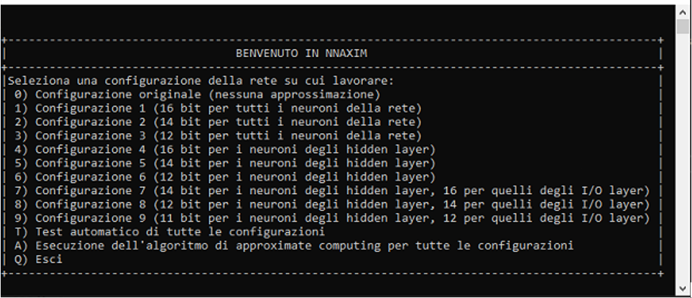
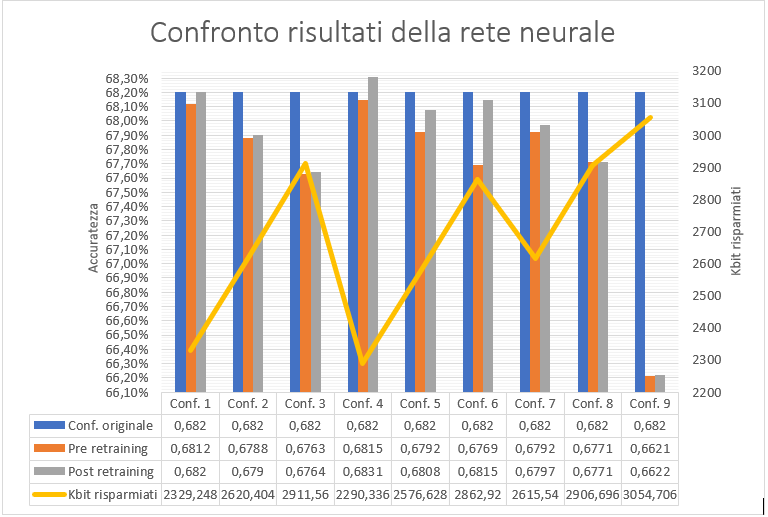

# NNAXIM (Neural Network Approximate Computing SIMulator)
Evaluating the impact of weighs accuracy reduction in a Neural Network over the Classification Accuracy

The amount of memory used to store the parameters of a neural network is dominated by storing weights. Therefore, reducing the number of bits to represent weights has a positive impact on use on the amount of resources required. The reduction in the number of bits also offers the possibility of using reduced arithmetic circuits with a consequent reduction in area, power and possibly a reduction in the critical path and therefore an increase in the clock frequency. The reduction in the number of bits used to represent weights certainly has an impact on the accuracy of the neural network. We want to evaluate this impact.

## Table of Contents

- [References](#references)
- [Screenshots](#screenshots)
- [Requirements](#requirements)
- [Dependencies](#dependencies)
- [Testing](#running-for-test)


## References

References available (italian only) at:
- doc/Relazione_Scavo_Messina.docx


## Screenshots





## Requirements

- Cmake
- Visual Studio (2015 or successive versions) with c++ compiler installed


## Dependencies

- tiny-dnn (repo: https://github.com/tiny-dnn/tiny-dnn)


## Running for Test
You can clone this project and run it following the next steps

#### 1 - Clone the project from develop branch
- Start Command Prompt window (cmd.exe).
- On the command line, write
  - ```git clone https://github.com/Taletex/NNAXIM.git ```
  
  
#### 2 - Download the CIFAR10 datasets
- Download the binary dataset, available at: https://www.cs.toronto.edu/~kriz/cifar-10-binary.tar.gz
- Move the downloaded archive to src/ac_nn
- Extract it in that location, you should see a folder named 'cifar-10-batches-bin' in src/ac_nn

#### 3 - Build the project for Visual Studio
- Start Command Prompt window (cmd.exe). 
- On the command line, write
```bash
cd NNAXIM/src
mkdir build 
cd build 
``` 
- Then you need to generate projects with below command (don't forget to delete CMakeCache.txt prior to running the command.)
  - Visual Studio 2015
    - 32bit : ``` cmake -G "Visual Studio 14 2015" .. ```
    - 64bit : ``` cmake -G "Visual Studio 14 2015 Win64" .. ```
  - Visual Studio 2017
    - 32bit : ``` cmake -G "Visual Studio 15 2017" .. ```
    - 64bit : ``` cmake -G "Visual Studio 15 2017 Win64" .. ```
- Open ac_nn_solution.sln file (located in build directory) with Visual Studio.
- Build Solution (F7)

#### 4 - Run the project
On Visual Studio (after compilation is done) you can delete all projects except from the ac_nn one (you can also leave them, but if you do it you need to set the ac_nn project as the starting project). Then you can run the project using "debug" or "run without debug" buttons.
Note: run the application in "Release" mode if you don't need to debug it. Running the application in "Debug" mode involves long execution time.
